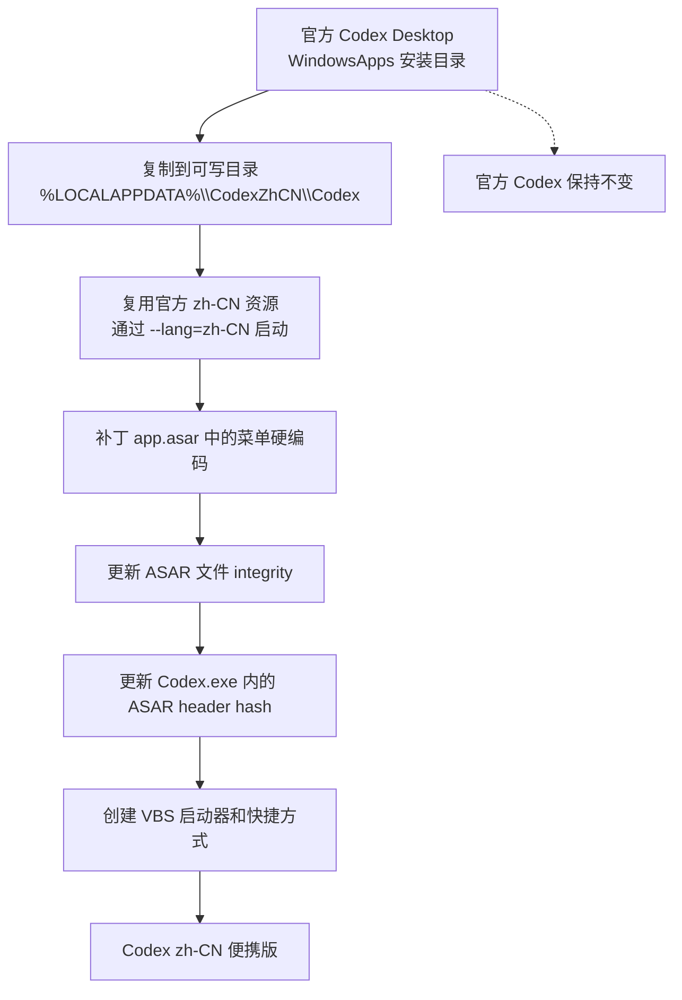
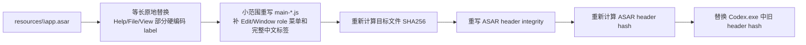

# WIN Codex Desktop zh-CN Portable

一键生成 Windows 版 Codex Desktop 中文便携副本，并补齐当前官方 `zh-CN` 下仍残留英文的桌面菜单。

Codex Desktop 本身已经内置大量中文资源，本工具不会维护整套前端翻译，也不会修改官方安装目录。它只做一件事：复制官方安装目录到用户可写位置，然后对 Electron 主进程菜单里明确缺失的中文化点做小范围补丁。

相关反馈：

- [openai/codex#19518](https://github.com/openai/codex/issues/19518)
- [openai/codex#17309](https://github.com/openai/codex/issues/17309)

## 特点

- 不修改 `C:\Program Files\WindowsApps` 官方安装目录。
- 默认生成到 `%LOCALAPPDATA%\CodexZhCN\Codex`，和官方版文件分离。
- 使用 Codex 官方内置 `zh-CN` 资源，只补 native 菜单和主进程硬编码缺口。
- 设置独立 `CODEX_ELECTRON_USER_DATA_PATH`，避免和官方版争用 Electron 单实例锁。
- 自动同步 ASAR integrity 与 `Codex.exe` 中记录的 ASAR header hash。
- 自动创建桌面和开始菜单 `Codex zh-CN` 快捷方式。
- 仓库只包含脚本和文档，不包含官方应用、安装包、账号数据或访问令牌。

## 原理



ASAR 补丁分两层：



## 已覆盖的菜单项

- `File` 菜单：`New Window`、`New Chat`、`Quick Chat`、`Open Folder...`、`Log Out`、`Exit`、`Settings...`、`About Codex` 等。
- `Edit` 菜单：`Undo`、`Redo`、`Cut`、`Copy`、`Paste`、`Delete`、`Select All`。
- `View` 菜单：侧边栏、终端、文件树、浏览器标签页、浏览器页面刷新、差异面板、查找、聊天切换、缩放、全屏等。
- `Window` 菜单：`Minimize`、`Zoom`、`Close`。
- `Help` 菜单：文档、新功能、自动化、本地环境、工作树、技能、MCP、故障排除、反馈、快捷键、性能跟踪等。

脚本会先做等长原地补丁，再对主进程菜单文件做一次小范围重写，用来补齐 Electron `editMenu` / `windowMenu` role 生成的子菜单，以及少数等长补丁无法写下的完整中文标签。

## 快速开始

双击中文菜单入口：

```text
codex_desktop_tool_zh.bat
```

推荐首次选择：

```text
1. 生成 / 补丁 / 启动中文便携版
```

如果官方 Codex 更新后出现异常，选择：

```text
2. 强制重建中文便携版
```

也可以直接运行：

```powershell
python .\codex_desktop_zh_cn_windows.py --dry-run
python .\codex_desktop_zh_cn_windows.py --launch
python .\codex_desktop_zh_cn_windows.py --rebuild --launch
```

## 菜单

```text
1. 生成 / 补丁 / 启动中文便携版
2. 强制重建中文便携版
3. 仅补丁现有便携版菜单
4. 创建快捷方式
5. 启动现有便携版
6. 显示路径和版本
7. 完全清理便携版文件
8. Dry-run 检查可补丁菜单字符串
0. 退出
```

## 默认路径

便携版应用：

```text
%LOCALAPPDATA%\CodexZhCN\Codex\Codex.exe
```

启动器：

```text
%LOCALAPPDATA%\CodexZhCN\launch_codex_zh_cn.vbs
```

便携版用户数据：

```text
%LOCALAPPDATA%\CodexZhCN\userData
```

快捷方式：

```text
桌面\Codex zh-CN.lnk
开始菜单\Codex zh-CN.lnk
```

## 与 Claude 版工具的差异

Claude Desktop 的中文化通常需要维护更完整的前端/desktop/statsig 翻译资源，还可能涉及 MSIX 下载、第三方模型配置、Code/Cowork 兼容等逻辑。

Codex Desktop 已经内置 `zh-CN` 资源，本工具只补官方当前遗漏的 Windows 桌面菜单中文化缺口。因此它更像一个临时兼容层：官方修复后可以直接停用或删除。

## 注意事项

- 本项目是社区工具，不是 OpenAI 官方项目。
- 本仓库不包含官方 Codex Desktop 程序文件、安装包、账号数据或访问令牌。
- 如果官方 Codex 更新后菜单 JS 结构变化，先运行菜单 `8` 查看还能识别多少补丁点。
- 如果便携版无法启动，使用菜单 `2` 强制从官方安装目录重建。
- 应用补丁前需要完全退出正在运行的 `Codex zh-CN` 便携版，否则 `app.asar` 可能被占用。
- 官方安装版仍可照常使用；`Codex zh-CN` 使用独立 `userData`，首次启动可能需要重新登录。

## 开源发布注意

不要提交以下内容：

- 官方安装包、MSIX、APPX。
- 解包或复制后的官方应用目录。
- `%LOCALAPPDATA%\CodexZhCN` 中的运行时文件、缓存、备份或用户数据。
- `%APPDATA%`、`%LOCALAPPDATA%`、`%USERPROFILE%\.codex` 中的账号数据、访问令牌、API key、日志或本地配置。

## License

MIT. See [LICENSE](LICENSE).
